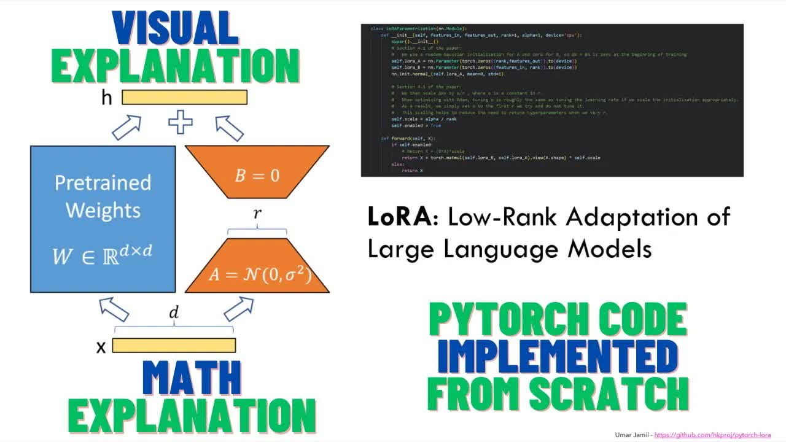

# LoRA：-Low-Rank-Adaptation-of-Large-Language-Models-Explained-visually-+-PyTorch-code-from-scratch

  <picture>
    
  </picture>

 

---

## Video Information

| Property | Value |
|----------|-------|
| **Video Name** | `LoRA：-Low-Rank-Adaptation-of-Large-Language-Models-Explained-visually-+-PyTorch-code-from-scratch` |
| **Original Link** | [YouTube Video](https://www.youtube.com/watch?v=PXWYUTMt-AU) |
| **Total Size** | **2 parts** - **75.73 MB** |
| **Quality** | **1080** |
| **Status** | **Complete (100%)** |
| **Password Protected** | **NO** |

---

---

## 🔤 Subtitles

| # | File | Link |
|---|------|------|
| 1 | `subtitle.zip` | [Download](https://raw.githubusercontent.com/Mohammad-Vatankhah/yt-downloader/master/videos/LoRA%EF%BC%9A-Low-Rank-Adaptation-of-Large-Language-Models-Explained-visually-%2B-PyTorch-code-from-scratch/subtitle.zip) |

> Contains all available subtitle languages. Extract to get `.vtt` files.

## Download Links

> ⬇️ Download **all parts**, then open `LoRA：-Low-Rank-Adaptation-of-Large-Language-Models-Explained-visually-+-PyTorch-code-from-scratch.zip` — the other parts are found automatically.

| # | File | Link |
|---|------|------|
| 1 | `LoRA：-Low-Rank-Adaptation-of-Large-Language-Models-Explained-visually-+-PyTorch-code-from-scratch.z01` | [Download](https://raw.githubusercontent.com/Mohammad-Vatankhah/yt-downloader/master/videos/LoRA%EF%BC%9A-Low-Rank-Adaptation-of-Large-Language-Models-Explained-visually-%2B-PyTorch-code-from-scratch/LoRA%EF%BC%9A-Low-Rank-Adaptation-of-Large-Language-Models-Explained-visually-%2B-PyTorch-code-from-scratch.z01) |
| 2 | `LoRA：-Low-Rank-Adaptation-of-Large-Language-Models-Explained-visually-+-PyTorch-code-from-scratch.zip` | [Download](https://raw.githubusercontent.com/Mohammad-Vatankhah/yt-downloader/master/videos/LoRA%EF%BC%9A-Low-Rank-Adaptation-of-Large-Language-Models-Explained-visually-%2B-PyTorch-code-from-scratch/LoRA%EF%BC%9A-Low-Rank-Adaptation-of-Large-Language-Models-Explained-visually-%2B-PyTorch-code-from-scratch.zip) |

---

## How to Extract

Download all parts into the **same folder**, then:

| OS | Steps |
|----|-------|
| **Windows** | Double-click `LoRA：-Low-Rank-Adaptation-of-Large-Language-Models-Explained-visually-+-PyTorch-code-from-scratch.zip` — opens in Explorer, WinRAR, or 7-Zip automatically |
| **Mac** | Double-click `LoRA：-Low-Rank-Adaptation-of-Large-Language-Models-Explained-visually-+-PyTorch-code-from-scratch.zip` — extracts with Archive Utility or The Unarchiver |
| **Linux** | `unzip LoRA：-Low-Rank-Adaptation-of-Large-Language-Models-Explained-visually-+-PyTorch-code-from-scratch.zip` or right-click → Extract Here (Ark/File Manager) |
| **Android** | Tap `LoRA：-Low-Rank-Adaptation-of-Large-Language-Models-Explained-visually-+-PyTorch-code-from-scratch.zip` in your file manager — or use [ZArchiver](https://play.google.com/store/apps/details?id=ru.zdevs.zarchiver) |

---

*This tool created by [avasam.ir](https://avasam.ir)*
